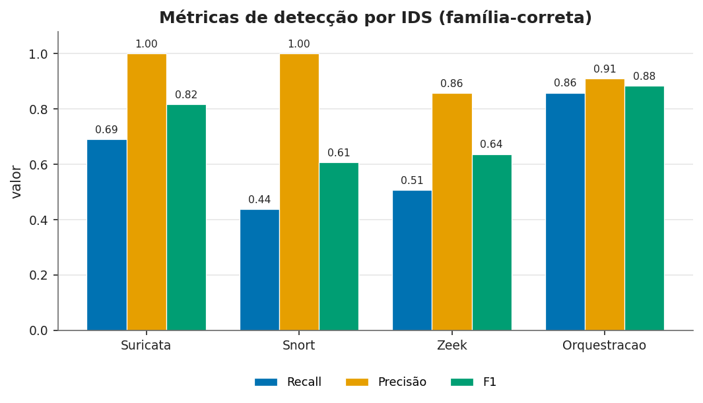
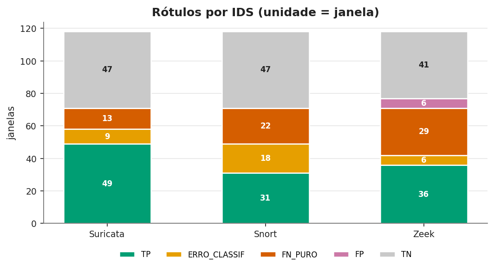
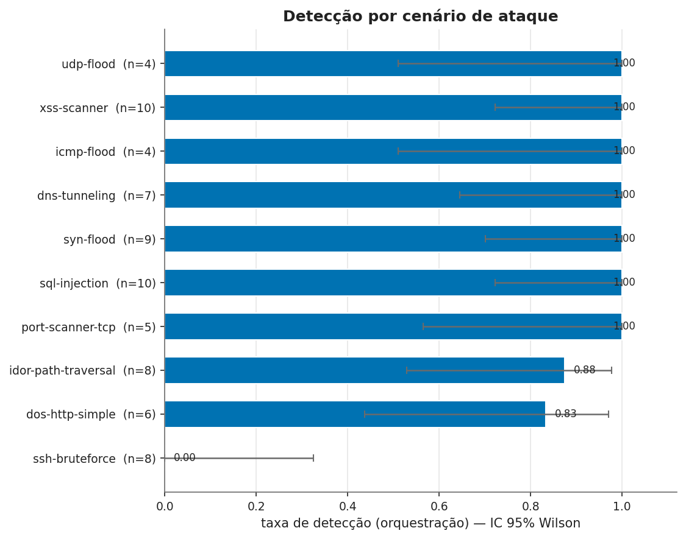
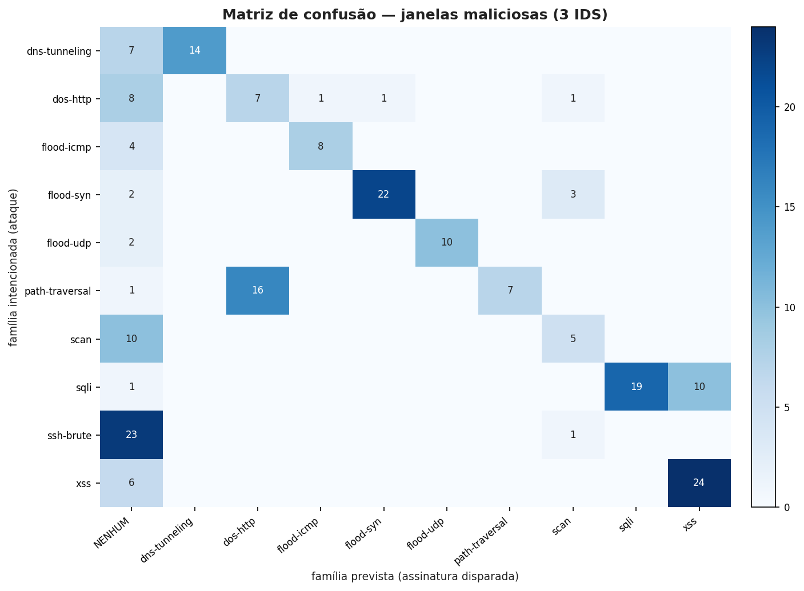
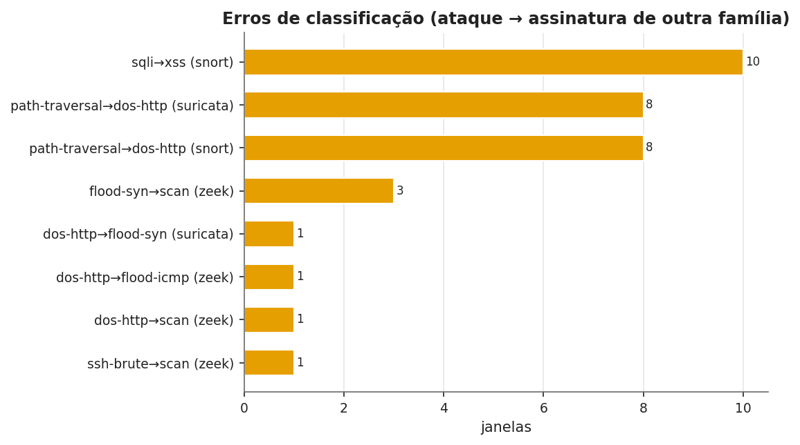

# Relatório — Campanha 02 (avaliação de IDS por interface de rede)

Ataques gerados a partir de `sbcup2026-ataques` contra alvos leves numa rede docker farejada pelos 3 IDS (Suricata, Snort, Zeek). **Sem a aplicação IoTEdu** — avaliação de como as regras se comportam diante do tráfego capturado.

## 0. Metodologia e detalhes do experimento

**Objetivo.** Medir a eficácia de detecção dos IDS (e da orquestração dos três) frente a tráfego malicioso e benigno numa interface de rede, avaliando também falsos positivos e **erros de classificação** (detecção com assinatura de família errada).

**Topologia.** Rede docker dedicada `ids-eval-net` (172.30.0.0/24) farejada pela bridge `br-<netid>`. Na mesma rede: alvos leves (HTTP `172.30.0.5:80`, SSH `172.30.0.6:22`), o atacante (`172.30.0.10`), o gerador benigno (`172.30.0.20`) e um IP de *flush* descartável (`172.30.0.250`, nunca contado). Os IDS rodam em `network_mode: host` (Suricata/Snort/Zeek do `mvpv1-snapshot`), recriados com `--force-recreate` (nunca `restart`). **A aplicação IoTEdu (back/front) não é usada.**

**Unidade de análise.** A *janela rotulada*: uma execução isolada de UM cenário (malicioso ou benigno), sem tráfego concorrente. Por janela salvam-se as fatias de alertas de cada IDS (por *byte-offset* + filtro de *timestamp*, que remove notices do Zeek escritos em lote e evita vazamento entre janelas), o PCAP, o stdout do gerador e um manifesto.

**Os 10 ataques (família intencionada e alvo):**

| # | Ataque (sbcup26) | Família | Alvo |
|--:|---|---|---|
| 1 | icmp-flood | flood-icmp | 172.30.0.5 |
| 2 | syn-flood | flood-syn | 172.30.0.5:80 |
| 3 | udp-flood | flood-udp | 172.30.0.5:80 |
| 4 | dos-http-simple | dos-http | 172.30.0.5:80 |
| 5 | sql-injection | sqli | 172.30.0.5:80 |
| 6 | xss-scanner | xss | 172.30.0.5:80 |
| 7 | idor-path-traversal | path-traversal | 172.30.0.5:80 |
| 8 | port-scanner-tcp | scan | 172.30.0.5 |
| 9 | ssh-bruteforce | ssh-brute | 172.30.0.6:22 |
| 10 | dns-tunneling | dns-tunneling | resolvers públicos |

**Os 6 cenários de tráfego benigno (avaliação de falsos positivos):**

| Benigno | Tráfego legítimo |
|---|---|
| benigno-icmp | ping em baixa taxa |
| benigno-http | GETs HTTP normais |
| benigno-dns | consultas DNS legítimas |
| benigno-ssh | conexões SSH pontuais |
| benigno-scan | acesso normal a 1 serviço |
| benigno-mix | HTTP+DNS+ICMP+SSH leves |

**Classificação por janela e IDS.** `TP` = ≥1 alerta da família correta; `FN_PURO` = nenhum alerta de ataque; `ERRO_CLASSIF` = detectou, mas só com assinatura de **outra** família (nem TP, nem FN puro); `FP` = janela benigna com qualquer alerta de ataque; `TN` = benigna sem alerta. A rajada de *flush* e alertas fora do intervalo da janela são descartados.

**Métricas.** Precisão, Recall (sensibilidade), Especificidade, F1, FPR, FNR, acurácia balanceada — por IDS e para a **orquestração** (detecta se qualquer IDS detecta). Denominador zero ⇒ métrica indefinida (nunca forçada a 0). As repetições são agregadas com **intervalo de confiança de Wilson 95%**.

## 1. Resumo da captura

- **Janelas avaliadas:** 240 (150 maliciosas, 90 benignas)
- **Horas de captura (total):** 6.88 h  (maliciosa: 3.81 h · benigna: 3.07 h)
- **Pacotes capturados (total):** 10,288,250 (maliciosa: 10,266,618 · benigna: 21,632)
- **Tipos de tráfego malicioso (10):** dns-tunneling, dos-http-simple, icmp-flood, idor-path-traversal, port-scanner-tcp, sql-injection, ssh-bruteforce, syn-flood, udp-flood, xss-scanner
- **Tipos de tráfego benigno (6):** benigno-dns, benigno-http, benigno-icmp, benigno-mix, benigno-scan, benigno-ssh

### Janelas e horas por cenário

| Cenário | Classe | Repetições | Horas | Pacotes |
|---|---|--:|--:|--:|
| benigno-dns | benigno | 15 | 0.53 | 45 |
| benigno-http | benigno | 15 | 0.51 | 11,936 |
| benigno-icmp | benigno | 15 | 0.50 | 2,559 |
| benigno-mix | benigno | 15 | 0.50 | 3,600 |
| benigno-scan | benigno | 15 | 0.52 | 2,633 |
| benigno-ssh | benigno | 15 | 0.51 | 859 |
| dns-tunneling | malicioso | 15 | 0.37 | 6,150 |
| dos-http-simple | malicioso | 15 | 0.30 | 30,075 |
| icmp-flood | malicioso | 15 | 0.25 | 6,337,885 |
| idor-path-traversal | malicioso | 15 | 0.23 | 45,691 |
| port-scanner-tcp | malicioso | 15 | 0.19 | 30,172 |
| sql-injection | malicioso | 15 | 1.20 | 163,196 |
| ssh-bruteforce | malicioso | 15 | 0.46 | 15,636 |
| syn-flood | malicioso | 15 | 0.26 | 15,225 |
| udp-flood | malicioso | 15 | 0.31 | 3,608,876 |
| xss-scanner | malicioso | 15 | 0.24 | 13,712 |

## 2. Métricas de detecção (família-correta) por IDS

> Detecção = ≥1 alerta com assinatura da **família correta**. Alertas de família errada NÃO contam como TP (ver §4).

| Alvo | TP | FP | TN | FN | Precisão | Recall | Especif. | F1 | FPR | Acur.Bal. |
|---|--:|--:|--:|--:|--:|--:|--:|--:|--:|--:|
| **suricata** | 101 | 0 | 90 | 49 | 1.000 | 0.673 | 1.000 | 0.805 | 0.000 | 0.837 |
| **snort** | 69 | 0 | 90 | 81 | 1.000 | 0.460 | 1.000 | 0.630 | 0.000 | 0.730 |
| **zeek** | 60 | 8 | 82 | 90 | 0.882 | 0.400 | 0.911 | 0.550 | 0.089 | 0.656 |
| **orquestracao** | 122 | 8 | 82 | 28 | 0.938 | 0.813 | 0.911 | 0.871 | 0.089 | 0.862 |

## 3. Estatística por cenário e IDS (repetições, IC 95% de Wilson)

| Cenário | Classe | IDS | n | Taxa detec. | IC95 | Erro classif. | FN puro | FP |
|---|---|---|--:|--:|:--:|--:|--:|--:|
| benigno-dns | benigno | snort | 15 | — | — | — | — | 0.000 |
| benigno-dns | benigno | suricata | 15 | — | — | — | — | 0.000 |
| benigno-dns | benigno | zeek | 15 | — | — | — | — | 0.067 |
| benigno-http | benigno | snort | 15 | — | — | — | — | 0.000 |
| benigno-http | benigno | suricata | 15 | — | — | — | — | 0.000 |
| benigno-http | benigno | zeek | 15 | — | — | — | — | 0.067 |
| benigno-icmp | benigno | snort | 15 | — | — | — | — | 0.000 |
| benigno-icmp | benigno | suricata | 15 | — | — | — | — | 0.000 |
| benigno-icmp | benigno | zeek | 15 | — | — | — | — | 0.067 |
| benigno-mix | benigno | snort | 15 | — | — | — | — | 0.000 |
| benigno-mix | benigno | suricata | 15 | — | — | — | — | 0.000 |
| benigno-mix | benigno | zeek | 15 | — | — | — | — | 0.200 |
| benigno-scan | benigno | snort | 15 | — | — | — | — | 0.000 |
| benigno-scan | benigno | suricata | 15 | — | — | — | — | 0.000 |
| benigno-scan | benigno | zeek | 15 | — | — | — | — | 0.133 |
| benigno-ssh | benigno | snort | 15 | — | — | — | — | 0.000 |
| benigno-ssh | benigno | suricata | 15 | — | — | — | — | 0.000 |
| benigno-ssh | benigno | zeek | 15 | — | — | — | — | 0.000 |
| dns-tunneling | malicioso | snort | 15 | 0.267 | [0.109, 0.520] | 0.000 | 0.733 | — |
| dns-tunneling | malicioso | suricata | 15 | 1.000 | [0.796, 1.000] | 0.000 | 0.000 | — |
| dns-tunneling | malicioso | zeek | 15 | 0.667 | [0.417, 0.848] | 0.000 | 0.333 | — |
| dos-http-simple | malicioso | snort | 15 | 0.333 | [0.152, 0.583] | 0.000 | 0.667 | — |
| dos-http-simple | malicioso | suricata | 15 | 0.733 | [0.480, 0.891] | 0.267 | 0.000 | — |
| dos-http-simple | malicioso | zeek | 15 | 0.000 | [0.000, 0.204] | 0.133 | 0.867 | — |
| icmp-flood | malicioso | snort | 15 | 1.000 | [0.796, 1.000] | 0.000 | 0.000 | — |
| icmp-flood | malicioso | suricata | 15 | 1.000 | [0.796, 1.000] | 0.000 | 0.000 | — |
| icmp-flood | malicioso | zeek | 15 | 0.000 | [0.000, 0.204] | 0.067 | 0.933 | — |
| idor-path-traversal | malicioso | snort | 15 | 0.000 | [0.000, 0.204] | 1.000 | 0.000 | — |
| idor-path-traversal | malicioso | suricata | 15 | 0.000 | [0.000, 0.204] | 1.000 | 0.000 | — |
| idor-path-traversal | malicioso | zeek | 15 | 0.667 | [0.417, 0.848] | 0.000 | 0.333 | — |
| port-scanner-tcp | malicioso | snort | 15 | 0.000 | [0.000, 0.204] | 0.000 | 1.000 | — |
| port-scanner-tcp | malicioso | suricata | 15 | 0.000 | [0.000, 0.204] | 0.000 | 1.000 | — |
| port-scanner-tcp | malicioso | zeek | 15 | 0.733 | [0.480, 0.891] | 0.000 | 0.267 | — |
| sql-injection | malicioso | snort | 15 | 0.000 | [0.000, 0.204] | 1.000 | 0.000 | — |
| sql-injection | malicioso | suricata | 15 | 1.000 | [0.796, 1.000] | 0.000 | 0.000 | — |
| sql-injection | malicioso | zeek | 15 | 0.733 | [0.480, 0.891] | 0.000 | 0.267 | — |
| ssh-bruteforce | malicioso | snort | 15 | 0.000 | [0.000, 0.204] | 0.000 | 1.000 | — |
| ssh-bruteforce | malicioso | suricata | 15 | 0.000 | [0.000, 0.204] | 0.000 | 1.000 | — |
| ssh-bruteforce | malicioso | zeek | 15 | 0.000 | [0.000, 0.204] | 0.067 | 0.933 | — |
| syn-flood | malicioso | snort | 15 | 1.000 | [0.796, 1.000] | 0.000 | 0.000 | — |
| syn-flood | malicioso | suricata | 15 | 1.000 | [0.796, 1.000] | 0.000 | 0.000 | — |
| syn-flood | malicioso | zeek | 15 | 0.333 | [0.152, 0.583] | 0.267 | 0.400 | — |
| udp-flood | malicioso | snort | 15 | 1.000 | [0.796, 1.000] | 0.000 | 0.000 | — |
| udp-flood | malicioso | suricata | 15 | 1.000 | [0.796, 1.000] | 0.000 | 0.000 | — |
| udp-flood | malicioso | zeek | 15 | 0.467 | [0.248, 0.699] | 0.000 | 0.533 | — |
| xss-scanner | malicioso | snort | 15 | 1.000 | [0.796, 1.000] | 0.000 | 0.000 | — |
| xss-scanner | malicioso | suricata | 15 | 1.000 | [0.796, 1.000] | 0.000 | 0.000 | — |
| xss-scanner | malicioso | zeek | 15 | 0.400 | [0.198, 0.643] | 0.000 | 0.600 | — |

## 4. Erros de classificação (detecção com assinatura errada)

Casos em que o IDS **detectou** o ataque mas atribuiu assinatura de **outra família** (ex.: flood classificado como SQLi). Não é falso negativo (houve detecção) nem falso positivo. Tratado como categoria própria.

| Cenário | IDS | Família correta | Classificada como | Janela |
|---|---|---|---|---|
| sql-injection | snort | sqli | xss | campanha02-sql-injection-malicioso-r06 |
| sql-injection | snort | sqli | xss | campanha02-sql-injection-malicioso-r04 |
| sql-injection | snort | sqli | xss | campanha02-sql-injection-malicioso-r05 |
| sql-injection | snort | sqli | xss | campanha02-sql-injection-malicioso-r01 |
| sql-injection | snort | sqli | xss | campanha02-sql-injection-malicioso-r15 |
| sql-injection | snort | sqli | xss | campanha02-sql-injection-malicioso-r12 |
| dos-http-simple | suricata | dos-http | flood-syn | campanha02-dos-http-simple-malicioso-r15 |
| dos-http-simple | zeek | dos-http | flood-icmp | campanha02-dos-http-simple-malicioso-r15 |
| idor-path-traversal | suricata | path-traversal | dos-http | campanha02-idor-path-traversal-malicioso-r10 |
| idor-path-traversal | snort | path-traversal | dos-http | campanha02-idor-path-traversal-malicioso-r10 |
| idor-path-traversal | suricata | path-traversal | dos-http | campanha02-idor-path-traversal-malicioso-r02 |
| idor-path-traversal | snort | path-traversal | dos-http | campanha02-idor-path-traversal-malicioso-r02 |
| sql-injection | snort | sqli | xss | campanha02-sql-injection-malicioso-r13 |
| idor-path-traversal | suricata | path-traversal | dos-http | campanha02-idor-path-traversal-malicioso-r12 |
| idor-path-traversal | snort | path-traversal | dos-http | campanha02-idor-path-traversal-malicioso-r12 |
| syn-flood | zeek | flood-syn | scan | campanha02-syn-flood-malicioso-r08 |
| idor-path-traversal | suricata | path-traversal | dos-http | campanha02-idor-path-traversal-malicioso-r07 |
| idor-path-traversal | snort | path-traversal | dos-http | campanha02-idor-path-traversal-malicioso-r07 |
| sql-injection | snort | sqli | xss | campanha02-sql-injection-malicioso-r14 |
| idor-path-traversal | suricata | path-traversal | dos-http | campanha02-idor-path-traversal-malicioso-r05 |
| idor-path-traversal | snort | path-traversal | dos-http | campanha02-idor-path-traversal-malicioso-r05 |
| sql-injection | snort | sqli | xss | campanha02-sql-injection-malicioso-r03 |
| idor-path-traversal | suricata | path-traversal | dos-http | campanha02-idor-path-traversal-malicioso-r11 |
| idor-path-traversal | snort | path-traversal | dos-http | campanha02-idor-path-traversal-malicioso-r11 |
| idor-path-traversal | suricata | path-traversal | dos-http | campanha02-idor-path-traversal-malicioso-r15 |
| idor-path-traversal | snort | path-traversal | dos-http | campanha02-idor-path-traversal-malicioso-r15 |
| syn-flood | zeek | flood-syn | scan | campanha02-syn-flood-malicioso-r11 |
| idor-path-traversal | suricata | path-traversal | dos-http | campanha02-idor-path-traversal-malicioso-r14 |
| idor-path-traversal | snort | path-traversal | dos-http | campanha02-idor-path-traversal-malicioso-r14 |
| syn-flood | zeek | flood-syn | scan | campanha02-syn-flood-malicioso-r12 |
| dos-http-simple | zeek | dos-http | scan | campanha02-dos-http-simple-malicioso-r13 |
| sql-injection | snort | sqli | xss | campanha02-sql-injection-malicioso-r11 |
| ssh-bruteforce | zeek | ssh-brute | scan | campanha02-ssh-bruteforce-malicioso-r01 |
| sql-injection | snort | sqli | xss | campanha02-sql-injection-malicioso-r10 |
| sql-injection | snort | sqli | xss | campanha02-sql-injection-malicioso-r02 |
| idor-path-traversal | suricata | path-traversal | dos-http | campanha02-idor-path-traversal-malicioso-r09 |
| idor-path-traversal | snort | path-traversal | dos-http | campanha02-idor-path-traversal-malicioso-r09 |
| syn-flood | zeek | flood-syn | scan | campanha02-syn-flood-malicioso-r14 |
| idor-path-traversal | suricata | path-traversal | dos-http | campanha02-idor-path-traversal-malicioso-r13 |
| idor-path-traversal | snort | path-traversal | dos-http | campanha02-idor-path-traversal-malicioso-r13 |
| dos-http-simple | suricata | dos-http | flood-syn | campanha02-dos-http-simple-malicioso-r07 |
| idor-path-traversal | suricata | path-traversal | dos-http | campanha02-idor-path-traversal-malicioso-r06 |
| idor-path-traversal | snort | path-traversal | dos-http | campanha02-idor-path-traversal-malicioso-r06 |
| icmp-flood | zeek | flood-icmp | scan | campanha02-icmp-flood-malicioso-r10 |
| dos-http-simple | suricata | dos-http | flood-syn | campanha02-dos-http-simple-malicioso-r14 |
| dos-http-simple | suricata | dos-http | flood-syn | campanha02-dos-http-simple-malicioso-r10 |
| idor-path-traversal | suricata | path-traversal | dos-http | campanha02-idor-path-traversal-malicioso-r01 |
| idor-path-traversal | snort | path-traversal | dos-http | campanha02-idor-path-traversal-malicioso-r01 |
| sql-injection | snort | sqli | xss | campanha02-sql-injection-malicioso-r07 |
| sql-injection | snort | sqli | xss | campanha02-sql-injection-malicioso-r09 |
| idor-path-traversal | suricata | path-traversal | dos-http | campanha02-idor-path-traversal-malicioso-r08 |
| idor-path-traversal | snort | path-traversal | dos-http | campanha02-idor-path-traversal-malicioso-r08 |
| idor-path-traversal | suricata | path-traversal | dos-http | campanha02-idor-path-traversal-malicioso-r03 |
| idor-path-traversal | snort | path-traversal | dos-http | campanha02-idor-path-traversal-malicioso-r03 |
| idor-path-traversal | suricata | path-traversal | dos-http | campanha02-idor-path-traversal-malicioso-r04 |
| idor-path-traversal | snort | path-traversal | dos-http | campanha02-idor-path-traversal-malicioso-r04 |
| sql-injection | snort | sqli | xss | campanha02-sql-injection-malicioso-r08 |

### Matriz de confusão (família intencionada × prevista, janelas maliciosas)

| intencionada\prevista | NENHUM | dns-tunneling | dos-http | flood-icmp | flood-syn | flood-udp | path-traversal | scan | sqli | xss |
|---|---|---|---|---|---|---|---|---|---|---|
| dns-tunneling | 16 | 29 | 0 | 0 | 0 | 0 | 0 | 0 | 0 | 0 |
| dos-http | 23 | 0 | 16 | 1 | 4 | 0 | 0 | 1 | 0 | 0 |
| flood-icmp | 14 | 0 | 0 | 30 | 0 | 0 | 0 | 1 | 0 | 0 |
| flood-syn | 6 | 0 | 0 | 0 | 35 | 0 | 0 | 4 | 0 | 0 |
| flood-udp | 8 | 0 | 0 | 0 | 0 | 37 | 0 | 0 | 0 | 0 |
| path-traversal | 5 | 0 | 30 | 0 | 0 | 0 | 10 | 0 | 0 | 0 |
| scan | 34 | 0 | 0 | 0 | 0 | 0 | 0 | 11 | 0 | 0 |
| sqli | 4 | 0 | 0 | 0 | 0 | 0 | 0 | 0 | 26 | 15 |
| ssh-brute | 44 | 0 | 0 | 0 | 0 | 0 | 0 | 1 | 0 | 0 |
| xss | 9 | 0 | 0 | 0 | 0 | 0 | 0 | 0 | 0 | 36 |

## 5. Falsos positivos no tráfego benigno

| Cenário benigno | IDS | Família(s) alertada(s) | Janela |
|---|---|---|---|
| benigno-http | zeek | scan | campanha02-benigno-http-benigno-r01 |
| benigno-scan | zeek | flood-icmp | campanha02-benigno-scan-benigno-r13 |
| benigno-scan | zeek | flood-icmp | campanha02-benigno-scan-benigno-r04 |
| benigno-mix | zeek | scan | campanha02-benigno-mix-benigno-r01 |
| benigno-mix | zeek | scan | campanha02-benigno-mix-benigno-r08 |
| benigno-mix | zeek | scan | campanha02-benigno-mix-benigno-r15 |
| benigno-icmp | zeek | scan | campanha02-benigno-icmp-benigno-r11 |
| benigno-dns | zeek | flood-icmp | campanha02-benigno-dns-benigno-r06 |

## 6. Síntese por questão de pesquisa

- **RQ1 — Eficácia por IDS.** Recall (detecção família-correta): Suricata 0.673, Snort 0.460, Zeek 0.400; orquestração 0.813.
- **RQ2 — Piores falsos negativos.** Cenários não detectados por nenhum IDS (sem cobertura efetiva): port-scanner-tcp, ssh-bruteforce.
- **RQ3 — Falsos positivos (tráfego benigno).** 8 janela(s) benigna(s) com alerta indevido (cenários: benigno-dns, benigno-http, benigno-icmp, benigno-mix, benigno-scan). FP por IDS: Suricata 0, Snort 0, Zeek 8.
- **RQ4 — Orquestração.** Recall combinado 0.813 vs. melhor IDS isolado 0.673 → ganho de +0.140. Combinar os três aumenta a cobertura.
- **RQ5 — Regras problemáticas / erro de classificação.** 57 janela(s) com detecção de família errada. Pares observados: dos-http→flood-icmp (zeek); dos-http→flood-syn (suricata); dos-http→scan (zeek); flood-icmp→scan (zeek); flood-syn→scan (zeek); path-traversal→dos-http (snort); path-traversal→dos-http (suricata); sqli→xss (snort); ssh-brute→scan (zeek). Ver §4 e a matriz de confusão.

## 7. Recomendações de ajuste de regras

Baseadas nos falsos negativos, falsos positivos e erros de classificação observados; cada item cita a causa-raiz na regra.

1. **SSH brute-force (FN quase total) — porta errada.** As regras `brute-force-ssh` vigiam a **porta 2222** (porta publicada no host), mas o servidor-alvo escuta na **porta 22** nativa do container, que é o que trafega na bridge farejada. Resultado: nenhuma regra casa. **Ajuste:** apontar as regras para `22` (ou `[22,2222]`); o mesmo vale para Telnet (`23` vs `2323`). Alternativa: atacar as portas publicadas no host. (O HTTP funcionou porque a porta 80 do container coincide com `$HTTP_PORTS`.)
2. **`sqli → xss` (erro de classificação, Snort) — regra de XSS genérica demais.** A regra *XSS (Scanner Alta Frequência)* (sid 1000049) dispara com `http_uri; content:"<"; detection_filter count 30/10s` — ou seja, **qualquer** rajada de requisições contendo `<` na URI. Os payloads do `sqlmap --level=3` contêm `<` e alto volume, disparando XSS antes/no lugar de SQLi. **Ajuste:** exigir um token XSS real (`<script`, `<svg`, `onerror=`, `javascript:`) em vez de `<` isolado, ou remover o gatilho puramente por taxa.
3. **`path-traversal → dos-http` (erro de classificação) — limiar de DoS pega o fuzzing.** O `ffuf` varre a wordlist em alta taxa e cruza os limiares de `dos-http` (ex.: *Excessive GETs* 100/5s, *DoS GET Flood* 50/5s), enquanto as regras de conteúdo de path-traversal casam em poucas janelas. **Ajuste:** dar prioridade/abrangência às assinaturas de conteúdo (`../`, `%2e%2e`, `/etc/passwd` com codificações) e elevar os limiares de DoS para exigir volume sustentado.
4. **Port scan TCP (FN alto) — falta regra dedicada.** Não há assinatura de *port scan* por conexão TCP; a varredura do `nmap -sT` só é (parcialmente) pega pelo Zeek. **Ajuste:** adicionar regra de scan (ex.: `detection_filter` de SYNs a múltiplas portas distintas por origem) ou habilitar detector de scan.
5. **Falsos positivos do Zeek (8 janelas) — limiares de scan/ICMP sensíveis.** Tráfego benigno (curl/nping em baixa taxa) foi rotulado como *scan* ou *flood-icmp*. **Ajuste:** elevar os limiares das políticas de Scan e de ICMP do Zeek (contagem/intervalo) para não alertar em uso legítimo esporádico.
6. **DNS tunneling (parcial) — limiar/entropia.** Detectado em parte das janelas; as demais não cruzaram o limiar. **Ajuste:** reduzir o limiar de taxa e/ou somar verificação de entropia/comprimento do subdomínio.

> Todos os ajustes devem ser revalidados nesta mesma bancada (a ferramenta `rodar-campanha.sh` reexecuta a campanha e regenera métricas + figuras), preservando o *freeze* de regras/imagens em `regras/hashes.txt` como linha de base.

---
_Gerado por gera_relatorio.py (campanha02)._
